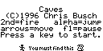
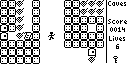
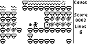
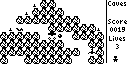
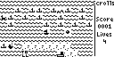
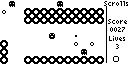
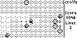
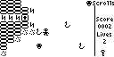

# Ti85 Calculator Games

Hello, I am Chris Busch and I wrote Caves, Scrolls and Crunch games for the Ti85 Graphics Calculator back in the late 1990s.  
I thought this source code was lost but I was able to find some old floppy disks and recover most of the source code. 
I am missing the level compiler source (presumably in C++) and the source code for the the level handler code.  
However, if one has access to an MS-DOS machine they can still create levels and compile them to 85s files.

# What is Crunch, Scrolls, and Caves?

Crunch was the first game to bring sound to the TI85 calculator.  Scrolls and Caves are early scrolling games.  I wrote Crunch first, then later Scrolls and finally Caves.

## Caves

  

 

Caves is a side scroller game system written for the TI-85 calculator that uses ZShell to take
full advantage of the Z80 processor.  It utilizes full-way scrolling for
acrobatic jumping excitement.

Caves is composed of CENGINE and accompanying LVL programs.  LVL programs
define the story and CENGINE does the work of playing them out.

### Story:

Since the Caves system can have multiple LVL programs, the story can vary
from one LVL to the next.  However, this is the widest known story...

In Caves, you need to retrieve the artifact of wisdom from a deep secret
world.  At your disposal is your trusty pellet gun and your strong jumping
legs.

Beware, danger awaits you. The monsters will try to hurt you if they find
you.  And if they do not get you, the fire will burn you.

When you retrieve the artifact of wisdom, you will travel to another distant
land.  There your quest continues.

### Tips:

  . You can shoot monsters' bombs to get rid of them.
  . You can only carry one key at a time.  Use your the keys wisely!
  . You will be rewarded with extra health as your score increases.
  . Some bricks are shootable and may reveal secret passages.
  . See if you can find the high jumper device, pushing down on it
    makes you soar into the air!

### How to Play:

In Caves, you may use keys simultaneously. Because of the advanced keyboard
polling method used by CENGINE, only some buttons are possible.
Use [2nd] to shoot, [ALPHA] to jump, the arrows to move, and [EXIT] twice 
to quit.  To cheat press [F1] and then [cos].  When you cheat, your score 
is divided in half and your lives are set to 2.  To pause press [F1] the 
calc will shut off after 1 minute to save your batteries, to continue press
[ON].  [F1] then [MORE] will shut off the calc right away.

## Scrolls

Scrolls is an overhead scrolling game written for the TI-85 calculator that uses ZShell to take
full advantage of the Z80 processor. 

Scrolls is composed of SENGINE and accompanying LVL programs.  LVL programs
define the story and SENGINE does the work of playing them out.

### Story:

Since the Scrolls system can have multiple LVL programs, the story can vary
from one LVL to the next.  However, this is the widest known story...

In Scrolls, you need to retrieve the scroll of wisdom from a bunch of tree
burnin' monsters who don't like you very much.  At your disposal is your
trusty sling shot and good supply of bombs.  You will need to master both
to survive!  But be careful of your own bombs, you can set them off too!

Beware, danger awaits you. The monsters will try to punch you if they find
you.  And if that doesnt get you, hopefully there fire will burn you.

When you retrieve the Scroll of wisdom, you will travel to another distant
land.  There your quest continues.

### Tips:

  . You can shoot your bombs, the fire, or the trees to get rid of them.
  . The world is very fertile, that is why trees grow everywhere.
  . You can only carry one key at a time.  Use your the keys wisely!
  . You will be rewarded with extra health as your score increases.
  . There are secret passages...

### How to Play:

Use [2nd] to fire your sling shot.  [2nd]+arrows at the same time will
fire in different directions.  Arrows to move.  [F1] then [Cos] will
half your score and set your lives to two. Use [Alpha] to set up a bomb
trap in front of you. [Alpha]+arrows will drop bombs in the direction
of the arrow key.  Press [Exit] twice to quit.  [F1] to pause (after
1 minute will shut off calc, then press ON to continue game).  [F1]
then [MORE] to shut off the calculator immediately, press ON to continue.

# Source code

Note: there are some extra ASM files in this repo that I need to clean up. 

I compile this code on a Win95 box and use a floppy to get it to a computer that has internet access.  Sneaker net indeed.

The Z80 ASM files are compiled via TASM on MS-DOS.  But there are newer compilers out there.

# Goals

The initial goal was to familiarize myself with the code once again and I think I accomplished that. I have fixed several bugs that I found:

1. Monsters no longer will pop up right next to you.  They only are "born" off screen.
2. Monster movement is vastly improved.
3. The controls are improved.  In Caves, now you can also use up arrow for jumping. In Scrolls, it is now possible to control bomb placement easier.
4. There are now special key presses for maps.  F1 then Graph gives an overview map.  F1 then STAT, gives you the ability to scroll the map.
5. Several bugs in levels was fixed.

A longer term goal is to port this to a newer TI Graphics Calculator or maybe port it over to a Windows Z80 emulator that would not require TI85 ROMs.
  