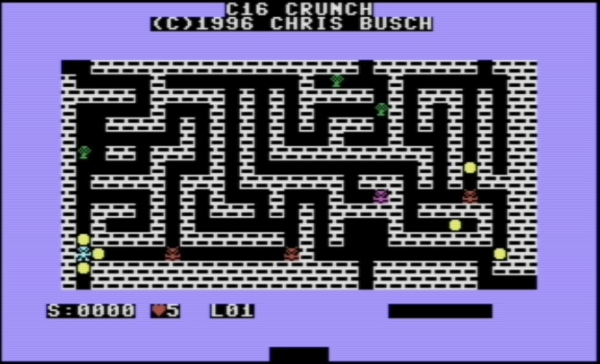

# Crunch (Commodore 16)

My port of my TI-85 **Crunch** to a **16KB Commodore 16**.

The goal of the game is collect all the coins. The monsters have personalities. You get a bonus for each monster not killed. Each level is a generated 32×16 maze.

Download <a href="c16crunch.prg">c16crunch.prg</a>. Tested in VICE (Commodore 16 mode) and on a real Commodore 16. Keyboard and joystick 🕹️ support.

