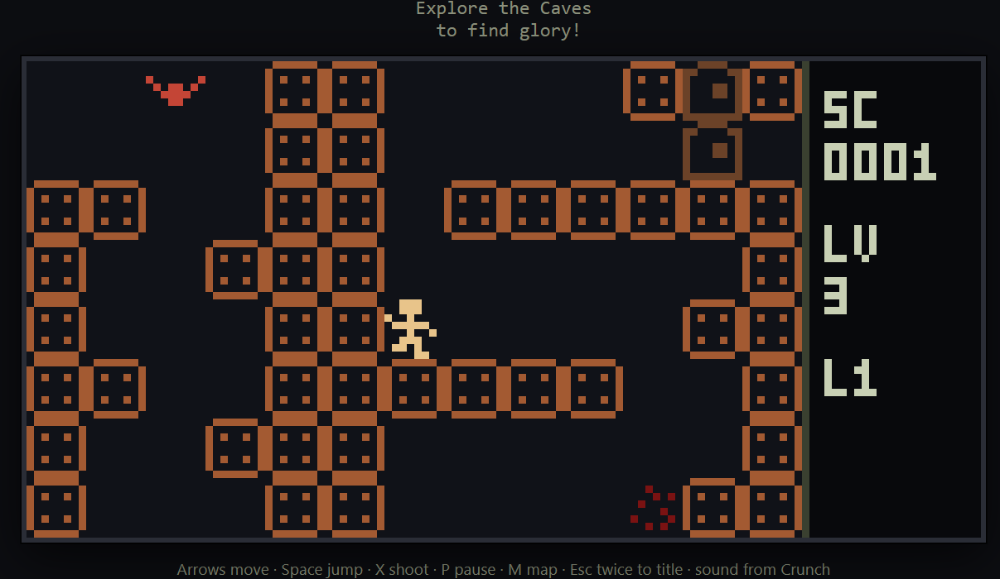
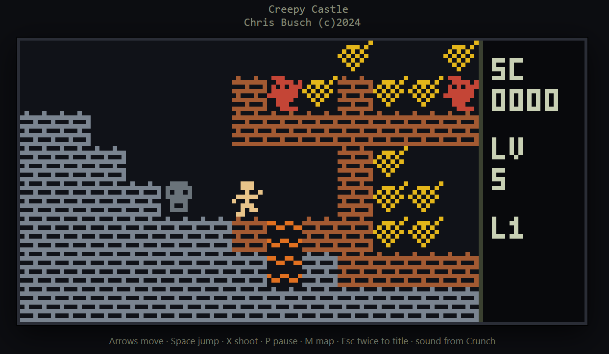

# Caves (HTML)

**Caves** is a side-scroller Chris Busch wrote for the TI-85 graphing calculator (CENGINE plus `.LVL` packs, originally under ZShell). This folder is a browser port of that game.



The point is simple: people who do not own a TI-85 — or a ROM, or ZShell — can still play the recovered levels. Open one HTML file. No calculator and no web server.

CENGINE was built to play many different LVL packs. Each pack is its own story, maps, and pictures. Castle is the best-known set; others (Star Trek, Pit, Gravity, and more) build the same way.

## Play

The hosted index is the easiest way to start: [https://vroomdev.github.io/ti85/caveshtml/built/index.html](https://vroomdev.github.io/ti85/caveshtml/built/index.html). Pick a pack from the list; each link is a full game.

If you already have this folder, built games also live in `built/`. Open `built/index.html` for a list, or open a single pack such as `built/castle.html` in any modern browser (`file://` is fine).



### Story

Because there can be many LVL packs, the story can change from one file to the next. The best-known story is this:

You need to retrieve the artifact of wisdom from a deep secret world. At your disposal is a pellet gun and strong jumping legs.

Beware: monsters will hurt you if they find you. If they do not get you, the fire will burn you.

When you retrieve the artifact (the scroll), you travel to another land and the quest continues.

### How the game works

Each pack is a stack of **32×32 tile maps**. The view is a small scrolling window (TI-85 sized: 128×64 pixels) that follows you. The map wraps: walk off one edge and you come in the other side.

You start with a few lives. Coins, shooting (or stomping) monsters, bombs, and finishing a map raise your score. Extra lives come as the score climbs, up to a cap. High scores and three initials are stored in this browser, separately for each LVL pack.

**Tiles you will see:**

| Letter | Role |
|--------|------|
| `.` | empty |
| `X` or `P` | your start (the cell is empty in play) |
| `b` | solid brick (not shootable) |
| `W` | wall (shootable; may hide a passage) |
| `c` | coin (falls if the cell below is empty) |
| `s` | scroll — the artifact; taking it loads the next map |
| `f` | lava / fire (hurts; respawns you) |
| `F` | bomb (hurts if you walk into it; shoot or stomp it) |
| `B` | cloud / high-jumper pad |
| `k` / `D` | key and door (one key at a time) |
| `M` | placed crawling monster (falls; bumping it hurts; stomp from above kills it) |
| `m` | placed flying monster (bumping hurts; stomp from above kills it) |
| `t` | tree (shootable, falls) |
| `S` | stain after a kill |

Roaming ghosts also spawn as you play. Patrols fall; seekers fly toward you. A monster walking into you hurts; landing on one from above (not during the upward jump) kills it. Some bricks (`W`) can be shot away.

There is no TI-85 F1+cos cheat and no battery auto-off.

### Tips

- You can only carry one key at a time. Use keys wisely.
- You are rewarded with extra health as your score increases.
- Some bricks are shootable and may reveal secret passages.
- Find the high jumper pad. Stand on it and press Down to soar into the air.

### Keys (laptop keyboard)

Keys can be used together. Focus the game page, then:

| Key | Action |
|-----|--------|
| Arrows | move |
| Space | jump (Up arrow also jumps) |
| Down | fall faster, or bounce high on a cloud |
| X, Z, or Ctrl | shoot |
| P | pause |
| M | overview map |
| Esc Esc | leave play and return to that pack’s title |
| Any key | start from the title screen |

Shoot plus a direction aims without walking that way.

On the calculator, jump was ALPHA, shoot was 2nd, pause was F1. Those are mapped to keys that exist on a PC keyboard.

## Layout

| Path | What it is |
|------|------------|
| `js/` | engine, renderer, input, `.LVL` parser, sound |
| `caves.css` | styles inlined into the built HTML |
| `levels/` | example pack source (`CASTLE.LVL`) |
| `DEFCHARS.DEF` | default 8×8 pictures if a pack omits some |
| `asm/` | original Z80 (CENGINE, actors, Crunch songs) — reference |
| `build.py` | one `.LVL` → one standalone HTML |
| `build-all.py` | every pack matching a glob, then `built/index.html` |
| `built/` | playable HTML (and optional `.txt` notes) |

Sound uses song tables recovered from Crunch / TunesLib (Caves on the calc had no beeper songs of its own).

## Build

You need **Python 3**. No extra packages.

One pack:

```
python build.py levels/CASTLE.LVL
```

Writes `built/castle.html` (output name is the `.LVL` basename, lowercased). Open that file in a browser.

The builder:

1. Reads the `.LVL`.
2. If the pack is missing any `#X0` / `#X1` pictures that exist in `DEFCHARS.DEF`, it **appends** those blocks to the text it embeds (the source file on disk is not rewritten).
3. Inlines `caves.css` and the `js/` modules into one script (so `file://` works; no `fetch` of the pack at runtime).
4. Embeds the pack as `LVL_DATA` and writes the HTML.

All packs at once (default glob is `../clvl/*.LVL` next to this folder — edit `LVL_GLOB` in `build-all.py` if your files live elsewhere):

```
python build-all.py
```

That runs `build.py` for each match, copies sibling `.TXT` notes into `built/`, warns if a map’s key count does not match its door count, and writes `built/index.html`.

While editing JavaScript, re-run the builder after changes. The playable artifact is always the HTML in `built/`.

## Making your own `.LVL`

A pack is a text file. The original MS-DOS compiler is gone; this port **parses the ASCII source** the same way the recovered Castle and other packs are written.

Use `levels/CASTLE.LVL` as a template.

### Header

```
My Pack
2 ;number of levels

$T="My Pack LVL"
$S="     A short title   "
$A=" Your name           "
$P="  Top player is "
```

- First non-comment line is the title shown in the file.
- `$T` is the old ZShell name; `$S` the story line on the title screen; `$A` the author line; `$P` the high-score prompt (initials and score are appended in the browser).
- Put a `N ;number of levels` line if you like; the parser also counts complete 32-row maps.

Comments start with `;`.

### Maps

Each level is **exactly 32 rows** of **32 characters** (a row may have `; comment` after the tiles). Only these letters are tiles:

`. c s f F B S t b W D k M m X P`

- Incomplete maps (not 32 rows of 32 valid letters) are dropped — finish the rectangle.
- Put one `X` or `P` for the start. Extra `X`/`P` cells are still empty; only the first spawn is used.
- Match `k` and `D` counts if you want every door openable (`build-all.py` prints a warning when they differ).
- The world wraps: the right edge meets the left, the bottom meets the top.

You can have as many 32×32 maps as you want in one file. Clearing a scroll loads the next map; after the last map, maps wrap and difficulty keeps climbing.

### Pictures

Sprites are 8×8, two banks (`0` and `1`) for a two-frame look. A block looks like:

```
#P0  ;Player PIC 1
00111000
00111000
10010000
01111100
00010010
00111000
01101000
00001100
```

`#` then the **letter** then **bank** `0` or `1`. Letters that have pictures: `. P M m c s f F B S t b D k` (brick `b` is also used for `W`).

If you omit a picture, `build.py` fills it from `DEFCHARS.DEF`. A header already in your pack wins.

### Build your pack

```
python build.py path/to/YOUR.LVL
```

Or drop the file next to the others and run `build-all.py`. Open `built/your.html`.

## History

- **v4.0:** Caves on the TI-85 saved high scores and initials (LVLs compiled by cmklvl v4.0).
- **HTML:** The same CENGINE-style play runs in a browser from a standalone HTML file. No calculator, ZShell, or ROM is required.

Original Caves / CENGINE: Chris Busch.
