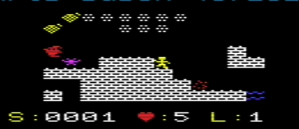
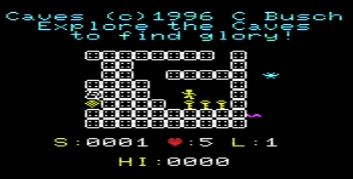
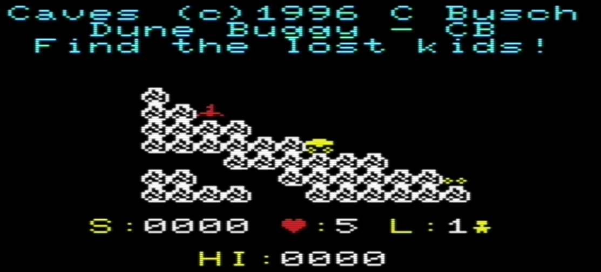
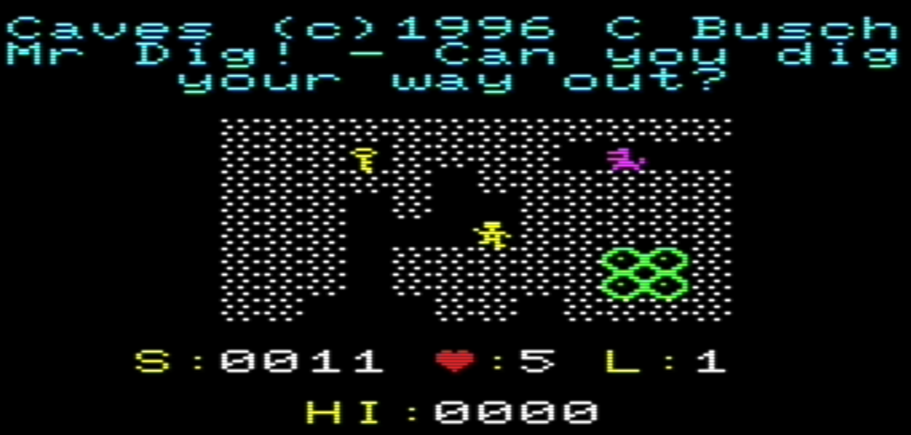

# VIC-20 Caves

I wrote **Caves** for the TI-85 graphing calculator in the late 1990s. This is my port of that game to a Commodore VIC-20 with 32K RAM.

The original system was **CENGINE** plus **LVL** packs: each pack carried the story, maps, and pictures, and the engine played them. Caves was the last of three TI-85 games I wrote (after Crunch and Scrolls). I thought the source was lost, then found it on old floppy disks. This folder is that same game on the VIC, still driven by those LVL packs.



## The game

You hunt the artifact of wisdom (the **scroll**) in a wrapping 32×32 cave. You have a pellet gun and a jump. Monsters hurt you on contact; lava burns. Grab a **key** to open one **door**. Stomp monsters and bombs from above. Stand on a cloud and press Down for a high bounce.

Each scroll loads the next map in the pack and the quest continues. Extra lives at scores 50, 150, 250, … (max 9). You can carry only one key at a time.

Different packs tell different stories. Creepy Castle, pit dives, Star Trek-themed caves, and others all use the same rules with their own maps and tiles.



## This port

The engine is C (cc65) on a **VIC-20 +32K**. Screen is the stock 22×23 layout with a 12×8 scrolling window. Custom tiles come from the pack’s pictures. Joystick and keyboard both work.

On a real machine you need 32K expansion. In VICE:

```text
xvic -memory all -autostart prg/CASTLE.prg
```

Built programs live in [`prg/`](prg/). A pack list with blurbs is [`prg/index.html`](prg/index.html).



## Controls

Shift is fire and C= is jump so you can still walk while shooting or jumping (the VIC only reports one letter key at a time). Press fire or any key on the title to start. The bottom row shows `Joy or Shift C= M,.`.

Joystick works best as it allows for full control.

| Key / stick | Action |
|-------------|--------|
| **C=** / up | Jump if grounded |
| **M** / left | Walk left |
| **.** / right | Walk right |
| **,** / down | Fall faster, or bounce high on a cloud |
| **Shift** / fire | Shoot (you do not walk while firing) |
| **P** | Pause; press P again to continue |
| **Q** | End the run; another run starts |

After a scroll, the next map loads on its own. After game over, a new run begins.

## PRG files

Each `.prg` is one LVL pack compiled into a loadable VIC-20 program (`SYS 8192` after load). `build.bat CASTLE.LVL` writes `prg/CASTLE.prg`. `build-all.bat` builds every pack from `../clvl/*.LVL`.

| File | Pack |
|------|------|
| [BLANK.prg](prg/BLANK.prg) | Blank LVL |
| [BUGGY.prg](prg/BUGGY.prg) | Dune Buggy — find the lost kids |
| [CASTLE.prg](prg/CASTLE.prg) | Creepy Castle (Chris Busch) |
| [CAVED2.prg](prg/CAVED2.prg) | Explore the caves |
| [CBLANK.prg](prg/CBLANK.prg) | (blank pack) |
| [DEEP.prg](prg/DEEP.prg) | Deep Caves |
| [ENTRPRZE.prg](prg/ENTRPRZE.prg) | NCC 1701-D |
| [GRAVITY.prg](prg/GRAVITY.prg) | Gravity Wins! |
| [MRDIG.prg](prg/MRDIG.prg) | Mr Dig! |
| [PIT.prg](prg/PIT.prg) | Dive into the pits |
| [PIT2.prg](prg/PIT2.prg) | Pits, another layout |
| [STARTREK.prg](prg/STARTREK.prg) | The Enterprizer |
| [STARTRK2.prg](prg/STARTRK2.prg) | StarTrek2 (Nick Leskiw) |



## Cool programming tricks

The 6502 has no multiply or divide, and cc65’s software `*` `/` `%` are slow. A lot of this port is about staying off those routines and not wasting RAM on structures the map already is.

### 1. Prime walk, no monster list

There is no array of monster objects as that wastes memory. Not to mention, many times move due to gravity.

The world is like a chess board, but if you scan across it and move a piece to the right, on the next step over, you'll see the same piece again. If handled in this manner, things move to the right or down would zip past.

This, every frame a cursor walks the 32×32 torus: `spotxy = (spotxy + stride) & 1023`. If that cell is a patrol, seeker, bomb, or other falling tile, it gets a turn. Spawned critters and map tiles are the same bytes, so one walk updates all of them.

But the trick is the stride  **239** is prime (and coprime with 1024, so it hits every cell). Remember a stride of 1 races along a row: things that walk *with* the cursor get extra turns and look faster going right than left. I scored every stride 1…1023 by how even the gaps are to the neighbor on the right, left, down, and up, and 239 was the most balanced. 

### 2. The playfield is the monster memory

As mentioned above, needed to save memory and CPU. Each of the 1024 cells is one byte. The **low nibble** is the tile class (blank, player, scroll, lava, patrol, seeker, …) via a flag table (`solid`, `shootable`, `falling`). The **upper nibble** holds runtime state: facing in bits 4–5, and a “this one was spawned” bit so killing it decrements the spawn cap. No parallel monster struct, no X/Y lists — when a seeker steps, we write `id | (dir << 4)` into the dest cell and blank the source.

Packed maps are even tighter: two cells per byte, unpacked into that playfield at level start.

### 3. Linear-feedback shift registers for random

The first RNG was `x = x * 17 + 1`. On this CPU that multiply is a real cost, and it showed up in the player loop as it's a terrible random on the low bits. Both generators are now Galois LFSRs: shift right, and if the bit that fell off was 1, XOR a tap mask. The 8-bit taps are `$B4` (period 255) and the 16-bit taps are `$D008` (period 65535).  

### 4. No `*` `/` `%` on the hot path

Those operators are slow! So avoid them.
Wrapping the 1024-cell map is `& 1023`, not `% 1024`. A row is `<< 5` (times 32). Half the map for a seeker test is `< 512`. A random 512-wide spawn offset is `rand16() & 511`. Score on screen is packed BCD, so digits are nibbles — no divide by 10. Tile pictures are `base + (bank << 4) + (cell & 15)`. The every-frame path stays shifts and masks.

Original Caves © 1996 Chris Busch.
