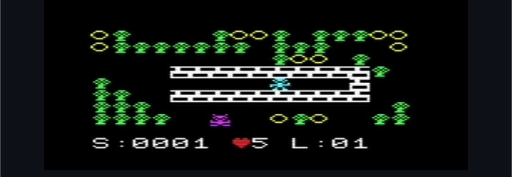

# Crunch (VIC-20)

My port of my TI-85 **Crunch** to an **unexpanded** VIC-20.

The goal of the game is collect all the coins. The monsters have 3 personalities. You get a bonus for each monster not killed.

Download <a href="crunch.prg">crunch.prg</a>. Tested in vice and a real vic 20 with 5k. Keyboard and joystick 🕹️ support. 

I had to crunch the game into 5k and still have the 8 levels by improving the game mechanics to use less memory to do more! The TI-85 had more RAM and a 6mhz CPU.

# Bugs and updates 

*NEW* Improved sound and improved game mechanics.

*NEW:* The game now starts slower but gets faster the higher the levels. Now you get 2 bonus points per monster not killed. 

*FIXED:* It was reported that the game may lock up after running out of lives. I tried to have a special song at that point but I think I will just trim that out to improve it. Updates to follow.
