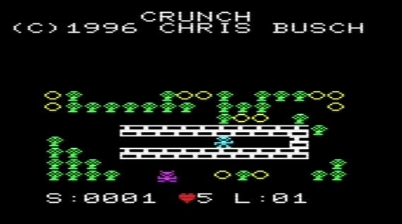

# Crunch (VIC-20)

My port of Chris Busch’s TI-85 **Crunch** to an **unexpanded** VIC-20.

Download crunch.prg. Tested in vice and a real vic 20 with 5k. Keyboard and joystick 🕹️ support. 

I had to crunch the game into 5k and still have the 8 levels by improving the game mechanics to use less memory to do more! The TI-85 had more RAM and a 6mhz CPU.

